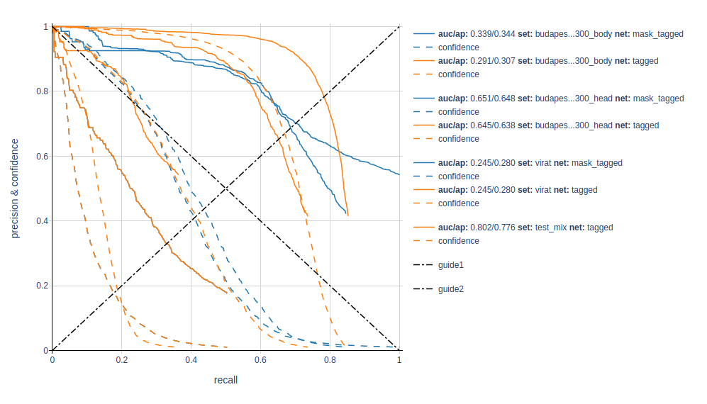

## Usage

```bash
# Pairing detections & annotations
$REPO/detector_benchmark/detection_parser.py \
--annotations annotations.csv \
--annotation_type body \
--detections detection.csv \
--detection_type body \
--outdir results \
--model_name rcnn \
--dataset_name coco \
--mask_outliers

# Plotting curves to .html
cd results
$REPO/detector_benchmark/curve_plotter.py -p
```

+ Select the head/body combination between annotations & detections with _**--annotation_type**_ / _**--detection_type**_, matching alike objects is done using **IoU**, matching heads and bodies is done with **Interception over Head**.
+ Format of **annotations**.csv lines: _**imagefile x1 y1 x2 y2 1 ...**_
  + Bonus: Using zeroes insted of ones masks an object, ignoring it during the evaluation.
+ Format of **detections**.csv lines: _**imagefile x1 y1 x2 y2 confidence ...**_
  + The **confidence** shall fall into the **[0.0,1.0]** range.
+ **(x1,y1)** is the left corner of object bounding box.
+ **(x2,y2)** is the bottom right corner.
+ The **y** coordinace increases from top to bottom, the **x** increases from left to right.
+ The **width** of a bounding box is **x2-x1+1**, the height likewise.
+ The recommended delimiter character is **"\t"**.
+ The _**--mask_outliers**_ switch masks and ignores objects that reach over the top of the image.


